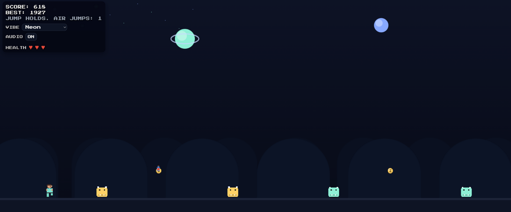
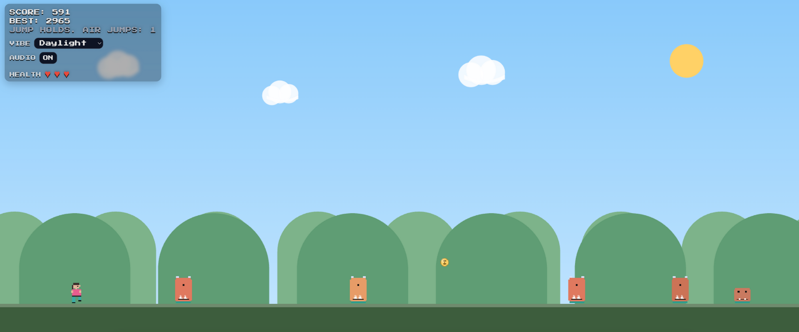
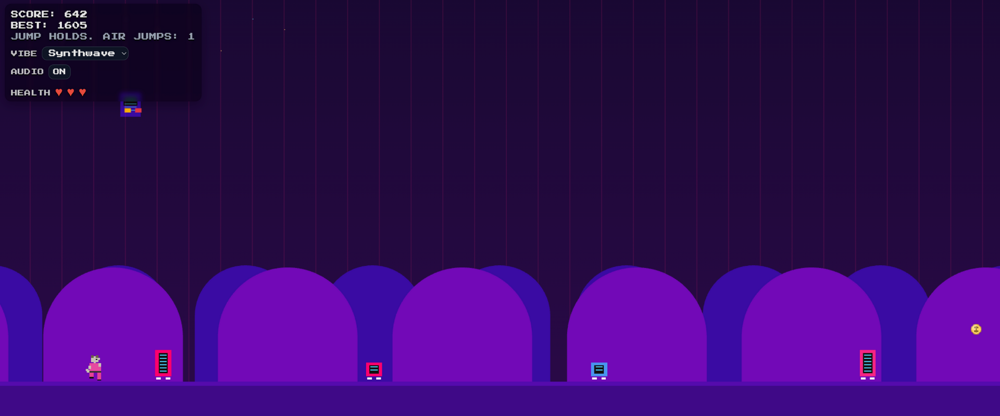
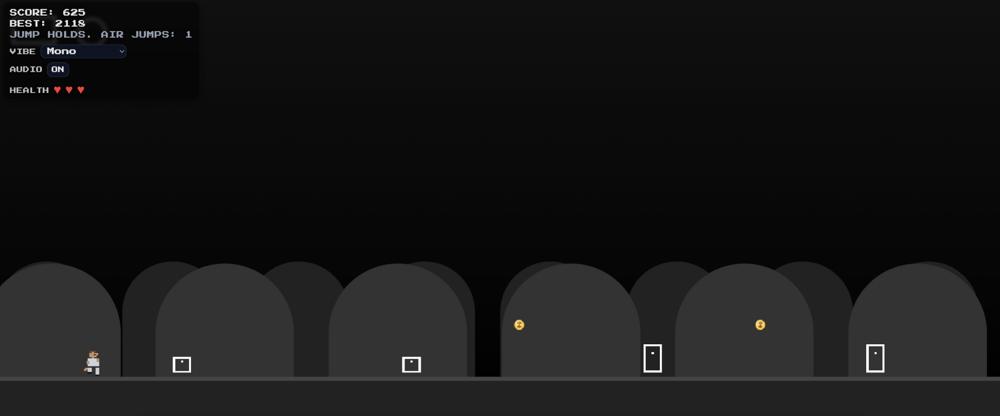

# DashX

DashX is a fast-paced endless runner built entirely in a single HTML file, using embedded CSS for styling and JavaScript for game logic.  

I made this game as a personal coding challenge to see how much I could pack into one file while keeping it fully playable on both desktop and mobile.

The idea started from a basic endless runner, but I wanted to make it unique by adding:
- Switchable visual themes
- A 3-health system
- Potion pickups for health recovery

Over time, I plan to expand DashX with new mechanics, more modes, and visual effects while keeping it optimised for smooth play.

Play here: **[https://dash-x-one.vercel.app/](https://dash-x-one.vercel.app/)**

---

## Features
- Endless runner gameplay with increasing difficulty
- Four visual themes: Neon, Daylight, Synthwave, Mono
- 3-health system with potion pickups for recovery
- Keyboard and touch controls
- Mobile-friendly scaling
- Score tracking

---

## Controls

**Desktop**
- `Space` or `Up Arrow` – Jump
- Double-tap `Space`/`Up Arrow` – Double Jump

**Mobile**
- Tap – Jump
- Double-tap – Double Jump

---

## Game Screenshots of 4 Different Modes

### Neon Vibe

### Daylight Vibe

### Synthwave Vibe

### Mono Vibe

---

## Tech Stack
DashX is built entirely with **vanilla web technologies** in a single HTML file:

- **HTML5** – Structure, semantic elements, and UI components
- **CSS3** – Embedded styling, gradients, flex layouts, and animations
- **JavaScript** – Game logic, interactivity, and rendering
- **Canvas API** – Real-time 2D graphics
- **Web Audio API** – Procedural sound effects
- **Local Storage API** – Save best scores
- **Responsive design** – Mobile-friendly scaling and touch controls

No external libraries or frameworks are used.

---

## Feedback
This is the first release of DashX. I’ll continue to update the game with more features over time.  

Feedback and suggestions are welcome — feel free to open an issue or share your ideas.
